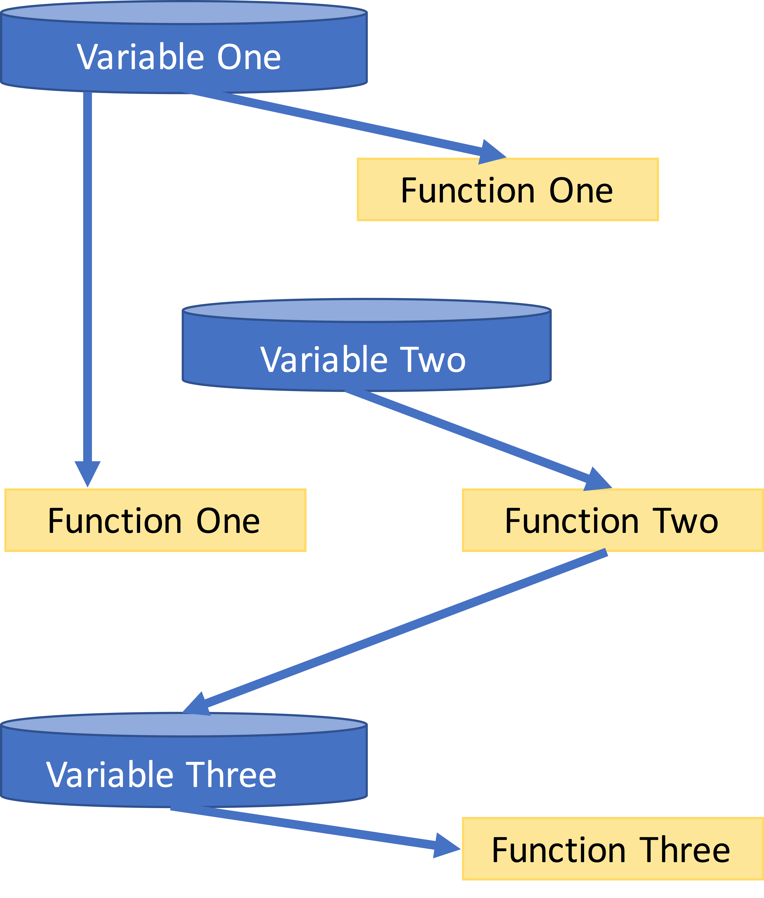
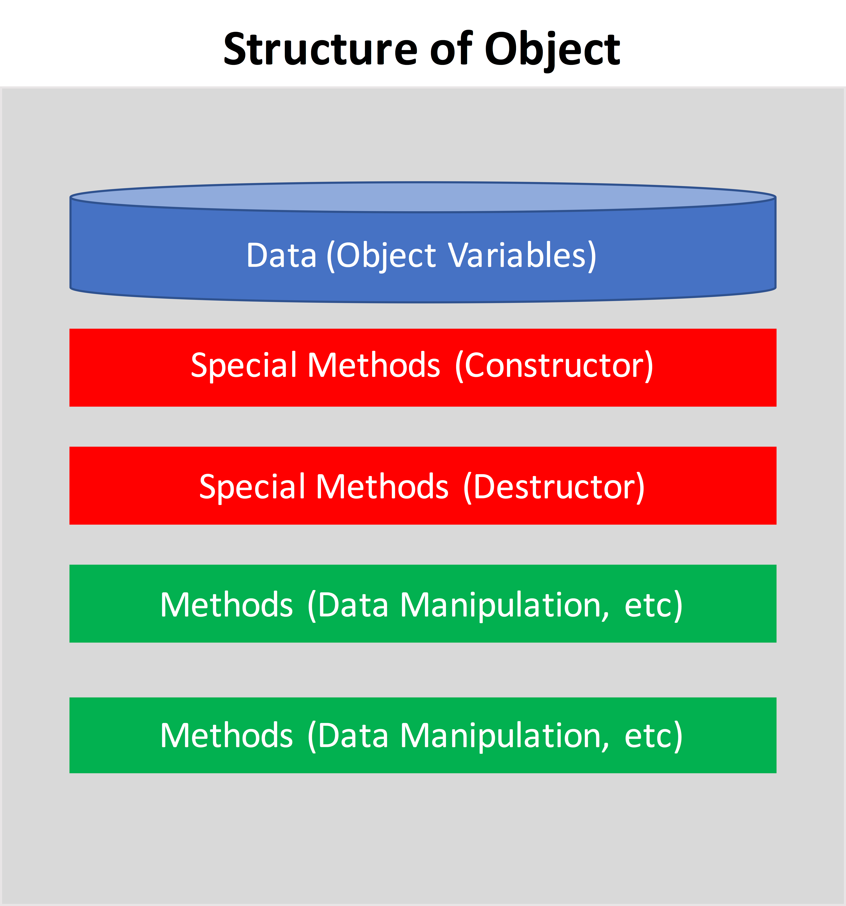
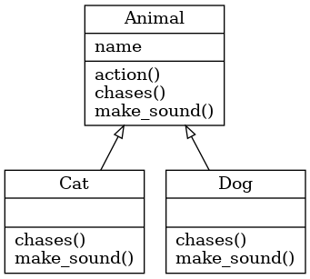

<link rel="stylesheet" href="/js/highlight/styles/gruvbox-light.css">

# Classes

BB1000 Programming in Python

---

layout: false

# TOC

* [Variables and Functions](#3)
* [Objects and Classes](#4)
  + [Class definition in Python](#6)
  + [Using objects in a program](#8)
  + [Instance attributes vs Class attributes](#9)
  + [Data encapsulation in object oriented programming](#10)
  + [Special methods and overloading](#11)
  + [Class inheritance](#13)
  + [Class diagrams](#19)
  + [Few practical tricks](#20)

---

# Variables and Functions

DATA: Variables
~~~python
str1 = "Hello World!"
str2 = "Python Programming"
lst = ['physics', 'chemistry', 1997, 2000]
~~~

Actions: Functions
~~~python
def printinfo(name, age):
    print("Name" , name)
    print("Age", age)
~~~

##Simple program

---

# Objects and Classes

---

##Objects and Classes

### Procedure Oriented Programming

* functions and variables used to make program
* suitable for small/medium programs

### Object Oriented Programming

* objects used to make program
* suitable for large programs

**Everything in Python is an *object*, and almost everything has attributes
(data) and ethods (functions for manipulating data)**

---

##Objects and Classes

Class - blueprint for creation of an object

~~~python
class Person:
    def __init__(self, given_name, surname):
        self.given_name = given_name
        self.surname = surname

    def __str__(self):
        return f"Person: {self.given_name} {self.surname}"

~~~

## Class definition in Python

~~~
class Name:
    ...
~~~

##Most important special method is a *constuctor*

~~~
def __init__(self, <list of parameters>):
    ...
~~~

---

##Objects and classes

###Ordinary class methods are defined as

~~~
def name_of_method(self, <list of paramters>):
    ...
~~~

###self is passed to all class methods and has the following meaning

* In the constructor init refers to newly created object
* In ordinary class methods it refers to the object for this method is called

*Note: the `__init__` method is often called a constructor, in analogy with
other OO languages, but the object has already been constructed entring the
function and is refered to with by the `self` variable. Initializer would be a
more correct description*

---

##Objects and Classes

## Using objects in a program

* creating an **instance** of an object in a program

~~~python
p = Person("Adam", "Smith")
~~~

* accessing instance attributes in a program

~~~python
p.given_name = 'John'
~~~

* calling instance methods in a program

~~~python
p.display_person()
~~~

---

## Instance attributes vs Class attributes

~~~python
class Person:
    number = 0  # class attribute
    def __init__(self, given_name, surname):
        self.given_name = given_name  # instance attribute
        self.surname = surname        # instance attribute

    def __str__(self):
        return f"Person: {self.given_name} {self.surname}"

~~~

* class attributes are shared by instances
* instance attributes are unique to each instance

---

## Data encapsulation in object oriented programming

* Public attributes can be freely used in side or outside of a class definition

~~~python
self.name = value #Public attribute
~~~

* Protected attributes should not be used otuside of the class definition
unless inside of a subclass definition

~~~python
self._value = value # Protected attribute
~~~

* Private atributes are inaccessible and invisible. It's is neihter possible to
  read nor write to those attribtes, except inside of the class definition
itself

~~~python
self.__name = value #Private attriute
~~~

---

## Special methods and overloading

* constructor

~~~
p = ClassName() # after creation calls p.__init__()
~~~

* official string representation

~~~
repr(p) # calls p.__repr__()
~~~

* informal string representation

~~~
str(p) # calls p.__str__()
~~~

* getting attribute

~~~
p.attr # calls p._getattribute__('attr')
~~~

---

* setting attribute

~~~
p.attr  = value # calls p._setattribute__('attr', value)
~~~

* getting list of attributes

~~~
dir(p) # calls x.__dir__()
~~~

* overloading binary operators

~~~
p._add__(self, other) # addition, +
p._sub__(self, other) # subtraction, -
p._mul__(self, other) # multiplication, *
p._truediv__(self, other) # division, /
p._floordiv__(self, other) # floor division, //
~~~

---

## Class inheritance

* Making derived class from base class:

~~~
class DerivedClassName(BaseClass): #inheriting from one base class
    ...
~~~

~~~
class DerivedClassName(BaseClass1, BaseClass2): #inheriting from multiple base classes
    ...
~~~

* All methods ar virutal, i.e. overriding of methods is an intrinsic property
  of Python

* Private attributes are not inherited

* Relationship between derived ans base classes

~~~
issubclass(DerivedClass, BaseClass) #True or False
~~~

* Relationship between instance and class

~~~
isinstance(Object, Class) # True or False
~~~

---

###Simple example of parent (base) and child (derived) classes

~~~python
class Parent:
    def __init__(self):
        print("Base constructor")

    def base_method(self):
        print('Calling base method')

class Child(Parent):
    def __init__(self):
        print("Derived constructor")

    def derived_method(self):
        print('Calling derrived method')

~~~
~~~
>>> c = Child()
Derived constructor
>>> c.base_method()
Calling base method
>>> c.derived_method()
Calling derrived method
~~~

---

###When to use inheritance?

* to avoid replication of code (same attributes and methods in different
  classes)

* to take advantages of existing Python classes

* when similar if statements are repeated throughout code

~~~
import moduleName
class DerivedClass(moduleName.BaseClass):
    ...
    # override/add any functions here.
~~~

---

###Example employee class

~~~python
class Person:
    def __init__(self, given_name, surname):
        self.given_name = given_name # instance attribute
        self.surname = surname  # instance attribute

    def get_person(self):
        return "Person : " + self.given_name + " " + self.surname

class Employee(Person):
    def __init__(self, given_name, surname, salary):
        super().__init__(given_name, surname)
        self.salary = salary

    def get_employee(self):
        return self.get_person() + ", salary: " + str(self.salary)

~~~

~~~
>>>  e = Employee('John', 'Doe', 29500)
>>>  print(e.get_employee())
Person : John Doe, salary: 29500
~~~

---

###Replacing repeated if-statements with inheritance

~~~python
def action(animal, name):
    print(name, 'is a', animal)
    make_sound(animal, name)
    chases(animal, name)

def make_sound(animal, name):
    if animal == 'Cat':
        print(name, "says 'Meow'!")
    elif animal == 'Dog':
        print(name, "says 'Bow-wow!'")

def chases(animal, name):
    if animal == 'Cat':
        print(name, "chases mouse")
    elif animal == 'Dog':
        print(name, "chases cat")
~~~
Consider adding more animals and more behaviours - 
this pattern becomes difficult to maintain in larger codes
~~~
>>> action('Cat', 'Felix')
Felix is a Cat
Felix says 'Meow'!
Felix chases mouse
~~~

---
###Replacing repeated if-statements with inheritance

~~~python
class Animal:
    def __init__(self, name):
        self.name = name

    def action(self):
        print(self.name, 'is a', self.__class__.__name__)
        self.make_sound()
        self.chase()

class Cat(Animal):
    def make_sound(self):
        print(self.name, "says 'Meow'!")

    def chase(self):
        print(self.name, "chases mouse")

class Dog(Animal):
    def make_sound(self):
        print(self.name, "says 'Bow-wow!'")

    def chase(self):
        print(self.name, "chases cat")
~~~

~~~
>>> Cat('Felix').action()
Felix is a Cat
Felix says 'Meow'!
Felix chases mouse
~~~

---

## Class diagrams

Are often used to illustrate dependencies between classes

* each class is represented by a box
* each box is divided name, attributes, methods
* arrows indicate inheritance relationships

---

## Few practical tricks

* Use separate file to describe a class and import it into the main program
* If you want to add some code to the class file, which is not definition of
  the class, use the following syntax

~~~python
if __name__ == "__main__":
    ...
    ...
~~~
